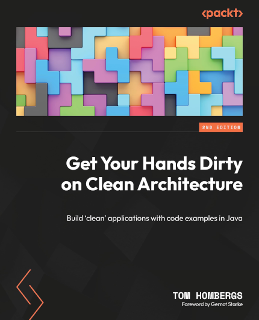
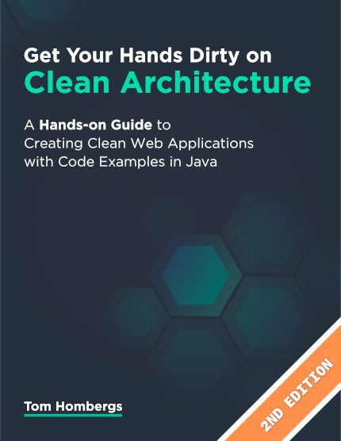
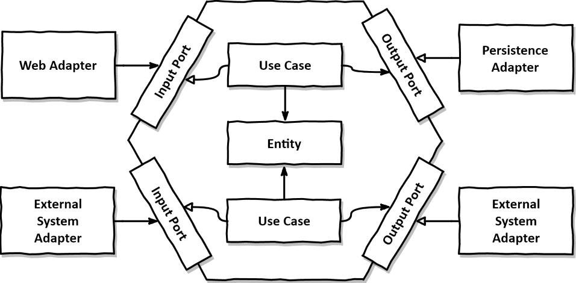
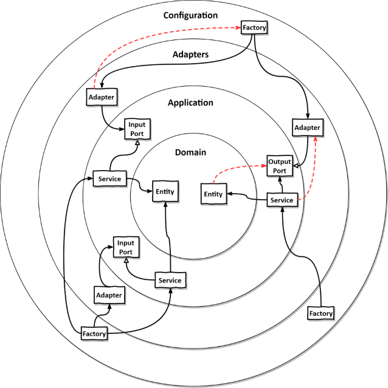

# Get Your Hands Dirty on Clean Architecture

This repository implements a small web app in the Hexagonal Architecture style, as discussed in the book "Get Your Hands Dirty on Clean Architecture".

The code has been updated to the 2nd edition of the book.

## Get the print book

## Get the e-book

This is the self-published version, which is only available electronically.

## Companion Articles

* [Hexagonal Architecture with Java and Spring](https://reflectoring.io/spring-hexagonal/)
* [Building a Multi-Module Spring Boot Application with Gradle](https://reflectoring.io/spring-boot-gradle-multi-module/)

## Prerequisites

* JDK 17
* this project uses Lombok, so enable annotation processing in your IDE

## About the book
### All About Hexagonal Architecture

* Learn the concepts behind "Clean Architecture" and "Hexagonal Architecture".
* Explore a hands-on approach of implementing a Hexagonal architecture with example code [on GitHub](https://github.com/thombergs/buckpal).
* Develop your domain code independent of database or web concerns.

### Get a Grip on Your Layers

* Learn about potential problems of the common layered architecture style.
* Free your domain layer of oppressive dependencies using dependency inversion.
* Structure your code in an architecturally expressive way.
* Use different methods to enforce architectural boundaries.
* Learn the consequences of shortcuts and when to accept them.
* ... and [more](#table-of-contents).

### What Readers Say

> Tom Hombergs has done a terrific job in explaining clean architecture - from concepts to code. Really wish more technical books would be as clear as that one!

Gernot Starke - Fellow at [INNOQ](https://www.innoq.com/en/staff/gernot-starke/), Founder of [arc42](https://arc42.org/), Author of Software Architecture Books, Coach, and Consultant

> Love your book. One of the most practical books on hexagonal architecture I have seen/read so far.

Marten Deinum - Spring Framework Contributor and Author of ["Spring 5 Recipes"](https://www.amazon.com/Spring-5-Recipes-Problem-Solution-Approach/dp/1484227891&tag=reflectorin0c-20) and ["Spring Boot 2 Recipes"](https://www.amazon.com/Spring-Boot-Recipes-Problem-Solution-Approach/dp/1484239628&tag=reflectorin0c-20)

> A book taken right out of the machine room of software development. Tom talks straight from his experience and guides you through the day-to-day trade-offs necessary to deliver clean architecture.

Sebastian Kempken - Software Architect at Adcubum

> Thank you for the great book, it helped me gain significant insight into how one would go about implementing hexagonal and DDD in a modern Spring project.

Spyros Vallianos - Java Developer at Konnekt-able

> After reading it I had one of these 'aha' moments when things finally click in your brain.

Manos Tzagkarakis - Java Developer at Datawise

### Table of Contents

1. Maintainability
2. What's Wrong with Layers?
3. Inverting Dependencies
4. Organizing Code
5. Implementing a Use Case
6. Implementing a Web Adapter
7. Implementing a Persistence Adapter
8. Testing Architecture Elements
9. Mapping Between Boundaries
10. Assembling the Application
11. Taking Shortcuts Consciously
12. Enforcing Architecture Boundaries
13. Managing Multiple Bounded Contexts
14. A Component-Based Approach to Software Architecture
15. Deciding on an Architecture Style
